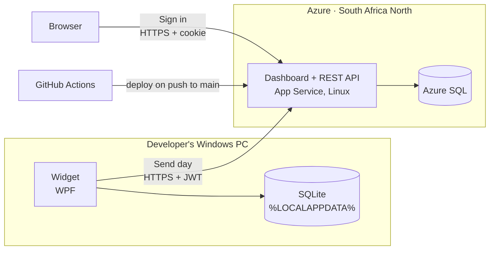
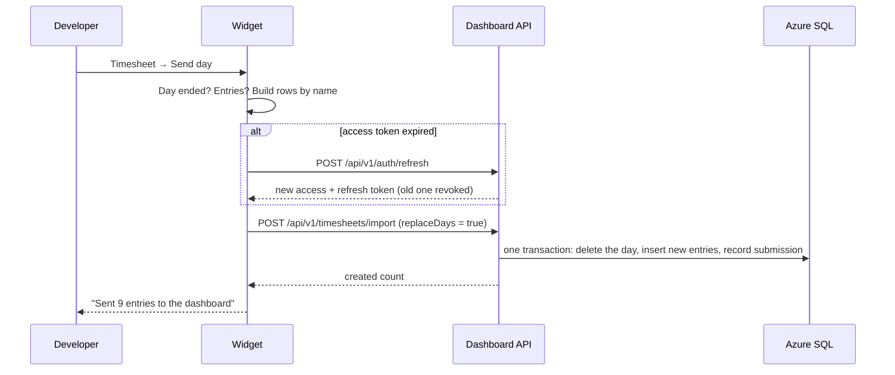
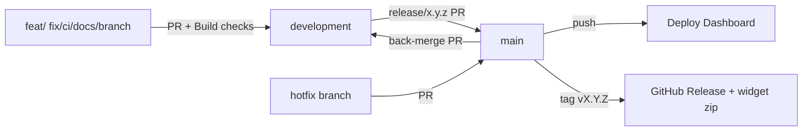
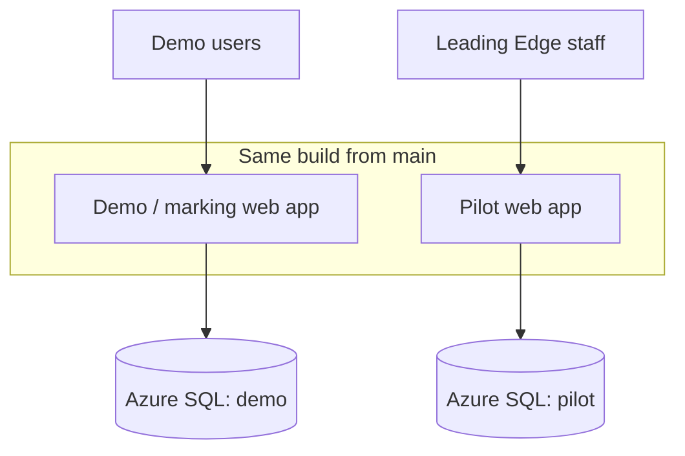

<div align="center">
 <a id="readme-top"></a>

##  * NB! * - To find demo account details, check the ARC submissions of ST10449392, ST10438312, or ST10434135

<h3 align="center">Time Planner</h3>
  <p align="center">
    XBCAD Repo for Time Planner, a check-in based time tracker for developers.
  </p>
</div>

## Team Members
<table>
  <tr>
    <td align="center"></td>
    <td>
      <b>Mihir Jagdaw</b><br/>
      Student Number: 10449392<br/>
      <a href="https://github.com/ST10449392">@ST10449392</a>
    </td>
  </tr>
  <tr>
    <td align="center"></td>
    <td>
      <b>Andre Fourie</b><br/>
      Student Number: 10438312<br/>
      <a href="https://github.com/AndreFourie12">@AndreFourie12</a>
    </td>
  </tr>
  <tr>
    <td align="center"></td>
    <td>
      <b>Dylan Jurgens</b><br/>
      Student Number: 10434135<br/>
      <a href="https://github.com/Doingle">@Doingle</a>
    </td>
  </tr>
</table>

## Table of Contents

<ol>
  <li><a href="#video-demonstration">Video Demonstration</a></li>
  <li><a href="#testing-the-production-release-v100-as-a-user-would-experience-it">Testing the Production Release</a></li>
  <li><a href="#project-overview">Project Overview</a></li>
  <li><a href="#features">Features</a>
    <ul>
      <li><a href="#desktop-widget">Desktop Widget</a></li>
      <li><a href="#web-dashboard-user">Web Dashboard (User)</a></li>
      <li><a href="#web-dashboard-admin">Web Dashboard (Admin)</a></li>
      <li><a href="#rest-api">REST API</a></li>
    </ul>
  </li>
  <li><a href="#how-it-works">How It Works</a>
    <ul>
      <li><a href="#architecture-overview">Architecture Overview</a></li>
      <li><a href="#check-in-backend">Check In Backend</a></li>
    </ul>
  </li>
  <li><a href="#technology-stack">Technology Stack</a></li>
  <li><a href="#repository-layout">Repository Layout</a></li>
  <li><a href="#getting-started">Getting Started</a>
    <ul>
      <li><a href="#prerequisites">Prerequisites</a></li>
      <li><a href="#1-clone-and-build">1. Clone and Build</a></li>
      <li><a href="#2-configure-the-dashboards-secrets">2. Configure the Dashboard's Secrets</a></li>
      <li><a href="#3-run-the-dashboard">3. Run the Dashboard</a></li>
      <li><a href="#4-create-people">4. Create People</a></li>
      <li><a href="#5-run-the-widget-windows">5. Run the Widget (Windows)</a></li>
      <li><a href="#6-try-a-full-round-trip">6. Try a Full Round Trip</a></li>
    </ul>
  </li>
  <li><a href="#configuration-reference">Configuration Reference</a>
    <ul>
      <li><a href="#dashboard-settings">Dashboard Settings</a></li>
      <li><a href="#widget-settings">Widget Settings</a></li>
      <li><a href="#per-user-check-in-settings">Per-User Check-In Settings</a></li>
    </ul>
  </li>
  <li><a href="#using-the-widget">Using the Widget</a></li>
  <li><a href="#using-the-dashboard">Using the Dashboard</a></li>
  <li><a href="#domain-model-and-business-rules">Domain Model and Business Rules</a>
    <ul>
      <li><a href="#app-data-appdbcontext-in-timeplannercore">App Data (AppDbContext)</a></li>
      <li><a href="#rules-worth-knowing">Rules Worth Knowing</a></li>
      <li><a href="#identity-data-authdbcontext-in-timeplannerdashboard">Identity Data (AuthDbContext)</a></li>
    </ul>
  </li>
  <li><a href="#import-and-export-formats">Import and Export Formats</a>
    <ul>
      <li><a href="#json-import-api-used-by-the-widget">JSON Import</a></li>
      <li><a href="#csv-import-website-upload-and-api">CSV Import</a></li>
      <li><a href="#validation-both-formats">Validation</a></li>
      <li><a href="#timesheet-export-company-layout">Timesheet Export</a></li>
      <li><a href="#sample-day-csv">Sample-Day CSV</a></li>
    </ul>
  </li>
  <li><a href="#rest-api-reference">REST API Reference</a>
    <ul>
      <li><a href="#authentication-flow">Authentication Flow</a></li>
      <li><a href="#endpoints">Endpoints</a></li>
      <li><a href="#conventions">Conventions</a></li>
    </ul>
  </li>
  <li><a href="#security">Security</a></li>
  <li><a href="#databases-and-migrations">Databases and Migrations</a></li>
  <li><a href="#testing">Testing</a></li>
  <li><a href="#cicd-and-releases">CI/CD and Releases</a></li>
  <li><a href="#deployment">Deployment</a>
    <ul>
      <li><a href="#dashboard-on-azure-app-service">Dashboard on Azure App Service</a></li>
      <li><a href="#hosting-rationale">Hosting Rationale</a></li>
      <li><a href="#environment-separation">Environment Separation</a></li>
      <li><a href="#distributing-the-widget">Distributing the Widget</a></li>
    </ul>
  </li>
  <li><a href="#project-notes">Project Notes</a></li>
  <li><a href="#references">References</a></li>
</ol>

---

## Video Demonstration

https://www.youtube.com/watch?v=JY2xQNmQe8U

---

## Testing the Production Release v1.0.0 (as a user would experience it):

This section is for testing **the released software exactly as a Leading Edge developer or project manager would receive it**, with nothing to build or software/IDE's install. To run the code from Visual Studio instead, see [Getting Started](#getting-started).


> ### Demo accounts *USERNAMES + PASSWORDS*
> | Account | Role | Email | Password |
> |---|---|---|---|
> | **Demo Admin** | Admin | demo.admin@email.com | Included in the Arc Submission as this is a public repo |
> | **Demo Developer** | Developer | demo.dev@email.com | Included in the Arc Submission as this is a public repo |

 **Dashboard:** https://timeplanner-dashboard-dj-dpd2byfyhfd4gthc.southafricanorth-01.azurewebsites.net

- The widget will work along side the dashboard, please see the steps "Downloading the widget" below.

- **Note:** These accounts have already undergone the first time password change.

- Please don't change the demo admin and developer passwords or deactivate the accounts: You can create new user accounts to test the temporary password generation and account reactivation/ deactiviation. 

### What each account can view

| | Demo Developer | Demo Admin |
|---|---|--|
| **Widget** (sign in and Send day) | Yes | Yes |
| Home, My Timesheet, My Reports (Excel and CSV download), Upload CSV | Yes, own data only | Yes, own data |
| Settings and Accessibility | Yes | Yes |
| **Team:** Overview, Submissions, Exports (one person or a .zip for everyone), Users | No, access denied | Yes, everyone's data |

- A good order to test is to  test the **widget with the Demo Developer** first, then sign in to the Dashboard as the **Demo Admin** and see that developer's submitted day in the Team tab under Submissions and Exports.

### Downloading The Widget: 

### 1. Download the widget
1. Open the **[latest release](https://github.com/Doingle/TimePlanner_LeadingEdge_INSY7315_XBCAD/releases/latest)**.
2. Under **Assets**, download `TimePlanner-Widget-<version>-win-x64.zip`. Ignore the "Source code" downloads.
3. Optional: check the download against the `.sha256` file in powershell:
   Get-FileHash .\TimePlanner-Widget-<version>-win-x64.zip -Algorithm SHA256


### 2. Extract it
1. Right click the zip, click **Properties**, tick **Unblock** if it's shown, click  **OK**. This can stop Windows treating every extracted file as downloaded from the internet.
2. Right click the zip, then click **Extract All…**, then choose a folder you'll keep, for example `C:\TimePlanner`.

The folder contains `TimePlanner.Widget.exe` and a `SampleData` folder. Nothing needs installing: the widget is self contained and includes .NET.

### 3. Create a shortcut (optional, recommended)
1. Right click `TimePlanner.Widget.exe`, then **Show more options**, then **Send to**, then **Desktop (create shortcut)**.
2. For a second shortcut that loads an example finished day: copy the shortcut, open its **Properties**, and add ` --sample-day` (with a space before it) at the end of **Target**. For example:
   `"C:\TimePlanner\TimePlanner.Widget.exe" --sample-day`

### 4. Get past Windows SmartScreen
The MVP isn't code signed yet. So on first start Windows shows **"Windows protected your PC"**:
1. Click **More info**.
2. Click **Run anyway**.

This is only needed once per downloaded version.

### 5. Run it
1. Start the widget (shortcut or exe). It appears in the **bottom right corner** of the screen, and its icon sits in the system tray (click **^** next to the clock if it's hidden).
2. **First run:** choose a check in interval, then click **Start tracking**.
3. **Fastest test:** start it with `--sample-day`. It loads a finished example day (9 entries, a lunch break and a short gap) onto the most recent weekday, then:
   1. tray icon, click **Timesheet**, then press **‹** until you reach the sample day (or leave as current day for any self added logging).
   2. review it, optionally **Fill** the sample data gap, then click **Send day**, then sign in as the **Demo Developer or Admin**
   3. open the Dashboard as the Demo Developer or admin: **My Timesheet** and **My Reports** show the day
   4. sign in as the **Demo Admin**: the day appears in **Team, Submissions** and **Exports**.

Only one widget runs at a time. If nothing happens when you start it, it's already running in the tray: right click its purple clock face icon, then click **Exit** and then start it again.

### Optional: Fill the Dashboard With a Sample Day (to see a populated dashboard day, this step is not required though):

To see the Dashboard populated without logging time yourself, as you'd otherwise have to go through the process of tracking a day to see full population, the widget can load a pre seeded csv day of work and send you can send it.

1. **The sample file comes with the widget.** `SampleData\sample-day.csv`, next to `TimePlanner.Widget.exe`, holds a finished working day in the company timesheet layout: 9 entries across three clients, a lunch break and a short untracked gap.
2. **The date is set for you.** The day is always loaded onto the **most recent weekday before today** (for example last Friday when run on a Monday), so the sample works in any week. It's only loaded if that day has no entries yet.
3. **Released widget:** add ` --sample-day` to the end of a shortcut's **Target**, or run `.\TimePlanner.Widget.exe --sample-day` in the widget's folder. (create a shortcut by right clicking and add the '--sample-day to the end of the target (name) of the shortcut)
4. **Send the day.** Exit any running widget first; only one can run. The widget confirms which day it loaded. Open **Timesheet** from the tray icon, press the  **‹** (back button) at the top left of the widget until you reach that day, optionally **fill** any gap, and press **Send day**, signing in with the demo account information shared in the table above when you're asked.
5. **Look at the Dashboard.** As that developer: Home, My Timesheet and My Reports for that week. As an admin: Team, then Overview, Submissions and Exports.

To load the sample again, exit the widget and rename `%LOCALAPPDATA%\TimePlanner` (press win + r and paste %LOCALAPPDATA%\TimePlanner, then navigate back once and delete or rename the foler), which starts with an empty local database.

<p align="right">(<a href="#readme-top">back to top</a>)</p>

## Project Overview
Time Planner is a check-in based time tracker made for software development teams. Its a Windows desktop widget that asks developers what the have been working on, and a web dashboard where they can review their time and administrators can oversee the team.

Time Planner was built for Leading Edge. The widget sits in the corner of the screen and checks in on them at a set interval, at check-in, it asks the user what they have been doing, where the user can then enter the client, a project, a activity, and any extra notes they wish to add. At the end of the day the user reviews the timesheet, fixes anything that is wrong and send the day to the dashboard. At the dashboard the user can see their won hours, and reports, and administrators can see who submitted, where the teams time went, and can export timesheets in the companies existing spreadsheet layout.

| Part                      | What it is                                                                                                   | Runs on                                          |
| ------------------------- | ------------------------------------------------------------------------------------------------------------ | ------------------------------------------------ |
| **TimePlanner.Widget**    | WPF tray app that tracks the working day, prompts check-ins, keeps a local timesheet and sends finished days | Windows 10 / 11 (x64)                            |
| **TimePlanner.Dashboard** | ASP.NET Core MVC website + versioned REST API (`/api/v1`) with cookie and JWT authentication                 | Any .NET 10 host (deployed to Azure App Service) |
| **TimePlanner.Core**      | Shared class library: domain model, EF Core data layer, check-in engine, business rules, sync client         | Used by both of the above                        |

Current version: **0.1.1** (set in [`Directory.Build.props`](Directory.Build.props); widget releases take their version from the git tag).

<p align="right">(<a href="#readme-top">back to top</a>)</p>


## Features

### Desktop Widget

- **Check-in prompts** - At a chosen interval (15 min to 3 h; 90 min by default). Only active working time counts towards the interval: breaks are taken out, and no prompt fires during the lunch window.

- **Snooze:** A check-in (10 minutes, up to 3 times per check-in by default).

- **Log now:**  Can be done at any time, without waiting for a prompt.

- **Pause / resume:** Used for breaks. Break time is never logged, and a period that spans a break is split into separate entries.

- **Breadcrumb pickers:** For *Client › Project* and *Activity › Sub-activity › …* (up to 3 levels), with recent choices and the last-used project and activity pre-filled. New clients, projects and sub-activities can be typed in on the spot, and unused ones can be removed.

- **End of day flow:** Log the remaining time or end without logging, then see a day summary (time logged, number of entries).

- **Timesheet review:** Step through past days, see entries, untracked gaps and breaks, fill gaps and add missing time, edit or delete entries (with a 10-second undo), and export the day to CSV.

- **Send day:** Send to the dashboard once the day has ended. The widget signs in once, never stores the password, and stays signed in for up to 30 days (a sign-in session is capped at 90 days).

- **Offline first:** Everything is saved to a local SQLite database, so the widget works without a network connection; only *sending* a day needs the dashboard.

- **Idle appearance:**  A pill (time left), ring (fills as time runs out) or dot. The widget can be always visible, faded until you point at it, or hidden in the tray until a check-in. A sound on check-in is optional.
<p align="right">(<a href="#readme-top">back to top</a>)</p>

### Web Dashboard (User)
- **Home:** Today's timeline ribbon, hours logged against the daily goal, unlogged gaps, the last submitted day, and a breakdown by category and project for today or this week.

- **My Timesheet:** A week or month laid out day by day, with each working day marked *Submitted*, *Pending*, *Missing* or *Not due* (read-only; corrections are made in the widget and sent again).

- **My Reports:** Totals, billable vs non-billable split, and breakdowns by category and project for a week, month or custom range. Downloads to Excel or CSV in the company's timesheet layout, with quick downloads for recent periods.

- **Upload CSV:** Import a timesheet file (for example one exported from the widget).

- **Settings:** Change your display name and password. **Accessibility:** text size (100–150%), bold and italic, remembered in the browser.
<p align="right">(<a href="#readme-top">back to top</a>)</p>


### Web Dashboard (Admin)
- **Overview:** Team hours, hours by category, project and person, and the submission rate for today and for the period.

- **Submissions:** A grid of every developer against every working day of the week or month, plus a detailed hours report for any range, grouped by project, company, person, day or activity.

- **Exports:** One person's timesheet as Excel or CSV, or a `.zip` with one file per person.

- **Users:** Create accounts (a temporary password is shown once), reset passwords, deactivate and reactivate accounts, and see lockouts and last sign-in.

- **Audit log:** Log of security-relevant events (through the API).


## Rest API
A versioned JSON API (`/api/v1`) with JWT bearer tokens and rotating refresh tokens, Swagger UI in development, row-level access rules, rate limiting and RFC 7807 problem-details errors. The widget uses it to sign in and send days, and any other client can use it as well.
<p align="right">(<a href="#readme-top">back to top</a>)</p>

## How it works

### Architecture overview


(Mermaid Editor, 2025)

Both sides share a domain model as well as one set of rules in TimePlanner.Core, so the widget and the server don't have different states regarding what a valid entry, client name or billable hour exists.

**Key design points**
1. **Local first.** The widget keeps its own SQLite database under `%LOCALAPPDATA%\TimePlanner`. It identifies the local user by Windows account name, creates them on first launch with default settings, and adds the internal company _Leading Edge (Internal)_ with its project Internal.
2. **Two separate databases.** The widget's local database and the dashboard's database are separate. They share the same schema (both use TimePlanner.Core), but nothing is replicated row by row. A day is sent as a list of entries described by names (company, project, activity path) rather than database ids, so a row means the same thing on any machine.
3. **The dashboard owns identity.** The dashboard keeps ASP.NET Core Identity accounts (ApplicationUser) in a separate AuthDbContext. Each account links to a time-tracking profile (AppUser) through AppUserId, which travels as the uid claim in both the cookie and the JWT. An imported entry always belongs to the caller identified by the token, never to a user named in the request.
4. **Send replaces the day.** The widget sends a finished day with `replaceDays: true`. The server checks every row first, then, in one transaction, deletes that user's entries for the day and stores the new ones. Sending the same day again after a correction is safe and leaves the server matching the widget.
5. **A submission is a record, not an approval.** Every accepted import records a DaySubmission (user + date + time). The admin grid is built from these records; there is no approve or reject workflow.
6. **Rules are enforced twice.** Services validate all the writes, and the database has check constraints for the same rules (entries end after they start, settings stay within range), so that a bug/manual edit can't store impossible rows.
7. **Billing is derived, not entered.** An entry is billable unless it's for the internal company or under the non billable Learning category.
8. **Times are wall clock local times.** Entries are stored and sent without a time zone.

### Check in backend
CheckInEngine in TimePlanner.Core is a small state machine that decides when to ask follow up about logging, one of Leading Edge's core requirements. It doesn't depend on the UI, so it's fully unit tested with a fake clock.

- **Interval on active time only:** pauses don't count, and no prompt fires inside the user's lunch window.
- **Snooze** delays a due check in, up to the snooze limit per check-in. **Skip** is allowed a limited number of times per day; after that, check-ins are required.
- **Ignored check-ins:** if a prompt isn't answered in time, the configured action applies (keep asking, by default).
- **Day sessions:** *Start tracking* opens a day and *End day* closes it. Pauses live inside the day, so break time is known exactly and never logged as work. Only one open day and one open pause per user, enforced by filtered unique indexes.

**Sending a day**


(Mermaid Editor, 2025)

- **Only finished days leave the PC:** a past day, or today after End day.
- An expired 30 minute access token is swapped silently with the refresh token. A refused send gets one refresh and one retry before the user is asked to sign in again.
- The widget remembers what it sent. If an entry on a sent day is edited later, the timesheet shows changed since sent.

If the server rejects the day, the widget lists the row errors and nothing is stored. If the dashboard can't be reached, the day stays saved locally and can be sent later.
<p align="right">(<a href="#readme-top">back to top</a>)</p>


## Technology stack
| Area      | Technology                                                                                                                                                 |
| --------- | ---------------------------------------------------------------------------------------------------------------------------------------------------------- |
| Runtime   | .NET 10 (`net10.0`, widget `net10.0-windows`), C# with nullable reference types and implicit usings                                                        |
| Desktop   | WPF, [Hardcodet.NotifyIcon.Wpf](https://github.com/hardcodet/wpf-notifyicon) (tray icon), Microsoft.Extensions.Hosting / DependencyInjection               |
| Web       | ASP.NET Core MVC (Razor views), ASP.NET Core Identity, JWT bearer authentication, built-in rate limiter                                                    |
| Data      | Entity Framework Core 10 with **SQLite** (widget, local dev, tests) and **SQL Server** (hosted dashboard)                                                  |
| Files     | [CsvHelper](https://joshclose.github.io/CsvHelper/) (CSV), [ClosedXML](https://github.com/ClosedXML/ClosedXML) (Excel `.xlsx`)                             |
| API docs  | Swashbuckle (OpenAPI + Swagger UI)                                                                                                                         |
| Other     | Windows DPAPI (`System.Security.Cryptography.ProtectedData`) for the widget's token. HtmlSanitizer is referenced by the dashboard but not used in code yet |
| Tests     | xUnit, `Microsoft.AspNetCore.Mvc.Testing` (in-memory test server), coverlet                                                                                |
| CI/CD     | GitHub Actions, Dependabot, CodeQL, Azure Web Apps deploy                                                                                                  |
| Front end | Plain CSS with design tokens and plain JavaScript (no framework, no CDN). Self-hosted Inter and Lora fonts                                                 |


<p align="right">(<a href="#readme-top">back to top</a>)</p>


## Repository layout

```
TimePlanner_LeadingEdge_INSY7315_XBCAD/
├── TimePlanner.slnx                
├── Directory.Build.props            
├── .github/
│   ├── workflows/                   
│   ├── dependabot.yml              `
│   └── release.yml                  
│
├── TimePlanner.Core/               
│   ├── Domain/Entities/             
│   ├── Domain/Enums/             
│   ├── Data/                        
│   ├── Migrations/                  
│   ├── Repositories/               
│   ├── Services/                   
│   │                                
│   ├── Sync/                        
│   ├── Extensions/                 
│   └── Adapters/                    
│
├── TimePlanner.Dashboard/          
│   ├── Program.cs                   
│   ├── Controllers/                 
│   ├── Controllers/Api/             
│   ├── Services/                    
│   ├── Security/                  
│   ├── Data/                        
│   ├── Data/SqlServer/              
│   ├── Views/                     
│   └── wwwroot/                    
│
├── TimePlanner.Widget/              
│   ├── App.xaml(.cs)               
│   ├── WidgetFlow.cs              
│   ├── WidgetService.cs             
│   ├── Services/                    
│   ├── Views/                     
│   │                               
│   ├── Controls/                    
│   ├── Themes/                     
│   ├── SampleData/sample-day.csv    
│   └── Assests/insy.ico           
│
├── TimePlanner.Core.Tests/          
└── TimePlanner.Api.Tests/           
```

---

<p align="right">(<a href="#readme-top">back to top</a>)</p>


## Getting started
### Prerequisites
| Tool                                                 | Needed for                      | Notes                                                                                                                    |
| ---------------------------------------------------- | ------------------------------- | ------------------------------------------------------------------------------------------------------------------------ |
| [.NET 10 SDK](https://dotnet.microsoft.com/download) | everything                      | CI uses `10.0.x`                                                                                                         |
| Windows 10 or 11                                     | building and running the widget | The WPF project targets `net10.0-windows` and can't be built on Linux or macOS. Core, Dashboard and tests build anywhere |
| An IDE                                               | development                     | A Visual Studio version that supports .NET 10 and `.slnx` solutions, JetBrains Rider, or VS Code with C# Dev Kit         |
| `dotnet-ef`                                          | only to add migrations          | `dotnet tool install --global dotnet-ef`                                                                                 |
| SQL Server / Azure SQL                               | optional                        | Only if you want to run the dashboard on SQL Server locally. SQLite is the default                                       |

<p align="right">(<a href="#readme-top">back to top</a>)</p>

### 1. Clone and build

```bash
git clone https://github.com/Doingle/TimePlanner_LeadingEdge_INSY7315_XBCAD.git
cd TimePlanner_LeadingEdge_INSY7315_XBCAD

# Windows: build the whole solution
dotnet build TimePlanner.slnx

# Linux/macOS: build everything except the WPF widget
dotnet build TimePlanner.Dashboard
dotnet build TimePlanner.Core.Tests
dotnet build TimePlanner.Api.Tests
```

Restore runs a NuGet vulnerability audit (`NuGetAuditMode=all`). A **high or critical** advisory on any direct or transitive package **fails the build** (`NU1903`, `NU1904`). Update the package rather than suppressing the warning

### 2. Configure the dashboard's secrets
No credential is committed to the repository. The dashboard needs at least a **JWT signing key**, and you'll want a **first administrator**. For local development, store them with user secrets (the project already has a `UserSecretsId`

```bash
cd TimePlanner.Dashboard

# a random key of at least 32 bytes (both commands print one)
#   bash:        openssl rand -base64 48
#   PowerShell:  [Convert]::ToBase64String([Security.Cryptography.RandomNumberGenerator]::GetBytes(48))
dotnet user-secrets set "Jwt:Key" "<paste the generated key>"

# the first admin, created at startup if no account with this email exists yet
dotnet user-secrets set "Seed:AdminEmail" "admin@example.com"
dotnet user-secrets set "Seed:AdminPassword" "<a strong password>"
```

The admin password must satisfy the Identity policy: **at least 12 characters, with an upper-case letter, a lower-case letter, a digit and a symbol**. If it doesn't, startup stops with Seeding the admin failed: ....

### 3. Run the dashboard

```bash
dotnet dev-certs https --trust          # once per machine
dotnet run --project TimePlanner.Dashboard --launch-profile https
```

|URL|What|
|---|---|
|`https://localhost:7043`|the website (sign in with the seeded admin)|
|`https://localhost:7043/swagger`|Swagger UI for the API (Development only, unless `Api:EnableDocs=true`)|
|`https://localhost:7043/health`|anonymous health check, `{"status":"ok"}`|
Use the https profile. The sign-in cookie is marked Secure, so the plain-http profile (`http://localhost:5075`) isn't a reliable way to sign in.

On first start the dashboard creates and migrates its database automatically (`timeplanner.db`, a SQLite file in the working directory, by default). It also creates the Developer and Admin roles and seeds the admin account. There is no SQL script to run.

### 4. Create people
Sign in as the admin, open Team → Users, and create an account for each developer (name, email, role). The temporary password is shown **once**. Hand it over securely. The person must choose their own password at first sign-in before they can use anything else, the widget included.

### 5. Run the widget (Windows)
```powershell
# against the hosted dashboard (the default address)
dotnet run --project TimePlanner.Widget

# against your local dashboard
$env:TIMEPLANNER_DASHBOARD_URL = "https://localhost:7043/"
dotnet run --project TimePlanner.Widget
```

The widget's launch profiles (in Visual Studio's run menu) cover the common cases:

|Profile|What it does|
|---|---|
|`TimePlanner.Widget`|normal start|
|`Widget (sample day)`|starts with `--sample-day` (see below)|
|`Widget (sample day, local dashboard)`|`--sample-day` and `TIMEPLANNER_DASHBOARD_URL=https://localhost:7043/`|

The widget opens on Setup (_Welcome to Time Planner_): pick a check-in interval and press Start tracking.


### 6. Try a full round trip
1. Start the dashboard locally (step 3) and create a developer account (step 4). Sign in once on the website as that developer and set a permanent password.
2. Start the widget with the Widget (sample day, local dashboard) profile. --sample-day loads SampleData/sample-day.csv into the most recent weekday before today, provided that day has no entries yet. It creates the entries and a finished day session, and turns gaps of 30 minutes or more into breaks.
3. Right-click the tray icon → Timesheet, step back to that day, review it and press Send day. Sign in as the developer when asked.
4. On the website, that day now shows as Submitted on My Timesheet (step back a week if it was last Friday), and in Team → Submissions for the admin.
<p align="right">(<a href="#readme-top">back to top</a>)</p>

## Configuration reference
### Dashboard settings
Settings come from the standard ASP.NET Core sources: `appsettings.json` → `appsettings.{Environment}.json` → user secrets (Development) → environment variables → command line. In environment variables, replace `:` with `__` (for example `Jwt__Key`, `ConnectionStrings__Default`).

| Key                                     | Default                      | Description                                                                                                                                                                                                                                                                                     |
| --------------------------------------- | ---------------------------- | ----------------------------------------------------------------------------------------------------------------------------------------------------------------------------------------------------------------------------------------------------------------------------------------------- |
| `ConnectionStrings:Default`             | `Data Source=timeplanner.db` | **Required.** Connection string for both the app data and the identity data (same database, separate migration histories).                                                                                                                                                                      |
| `Database:Provider`                     | `Sqlite`                     | `Sqlite` or `SqlServer`. Each provider has its own context types and migrations.                                                                                                                                                                                                                |
| `Jwt:Key`                               | _(none)_                     | **Required.** HMAC-SHA256 signing key, at least 32 bytes (UTF-8). API authentication throws `Jwt:Key must be configured with at least 32 bytes` without it.                                                                                                                                     |
| `Jwt:Issuer`                            | `TimePlanner.Dashboard`      | Token issuer (validated).                                                                                                                                                                                                                                                                       |
| `Jwt:Audience`                          | `TimePlanner.Clients`        | Token audience (validated).                                                                                                                                                                                                                                                                     |
| `Jwt:ExpiryMinutes`                     | `30`                         | Lifetime of an access token.                                                                                                                                                                                                                                                                    |
| `Jwt:RefreshDays`                       | `30`                         | Lifetime of each refresh token.                                                                                                                                                                                                                                                                 |
| `Jwt:RefreshMaxDays`                    | `90`                         | Absolute limit for one sign-in. After this the client must sign in with the password again, however often it refreshed.                                                                                                                                                                         |
| `Seed:AdminEmail`, `Seed:AdminPassword` | _(none)_                     | When both are set and no account with that email exists, an Admin account and its profile are created at startup. Changing them later does **not** change an existing account.                                                                                                                  |
| `AllowedHosts`                          | `localhost;127.0.0.1;[::1]`  | Host filtering. **Must be set to your public host name when deployed**, or every request is rejected with `400`.                                                                                                                                                                                |
| `Proxy:TrustForwardedHeaders`           | `false`                      | Honour `X-Forwarded-For` / `X-Forwarded-Proto`. Turn it on behind a TLS-terminating reverse proxy (such as Azure App Service), and only when the app can be reached through the proxy alone. Without it, rate limits count all users as one address and secure-only cookies and forms can fail. |
| `Api:EnableDocs`                        | `false`                      | Serve Swagger UI and the OpenAPI document outside Development.                                                                                                                                                                                                                                  |
| `RateLimiting:LoginPerMinute`           | `10`                         | Sign-in, refresh, sign-out and password-change requests per **IP address** per minute.                                                                                                                                                                                                          |
| `RateLimiting:ImportPerMinute`          | `20`                         | Timesheet imports and uploads per **signed-in user** per minute.                                                                                                                                                                                                                                |
| `Display:TimeZone`                      | `Africa/Johannesburg`        | The company time zone used for "today" (Windows and IANA ids are both tried; falls back to UTC).                                                                                                                                                                                                |
| `Goals:DailyHours`                      | `8`                          | Daily goal on Home when the person has no saved goal.                                                                                                                                                                                                                                           |
| `Home:DayStart`, `Home:DayEnd`          | `08:00`, `17:00`             | The window of Home's timeline (`HH:mm`), widened to fit earlier or later entries.                                                                                                                                                                                                               |
| `Home:LunchStart`, `Home:LunchEnd`      | `12:00`, `13:00`             | Lunch is not reported as an unlogged gap on Home.                                                                                                                                                                                                                                               |
| `Logging:*`                             | Information                  | Standard ASP.NET Core logging configuration.                                                                                                                                                                                                                                                    |

Other built-in behaviour (not configurable): sign-in cookie lifetime 8 hours (sliding); account lockout after 5 failed attempts for 15 minutes; request body limit 2 MB; HSTS for 365 days outside Development.

### Widget settings
| Setting                     | Where                                                        | Description                                                                                                                                                                                                                                                                                                                                                                                                                                 |
| --------------------------- | ------------------------------------------------------------ | ------------------------------------------------------------------------------------------------------------------------------------------------------------------------------------------------------------------------------------------------------------------------------------------------------------------------------------------------------------------------------------------------------------------------------------------- |
| `TIMEPLANNER_DASHBOARD_URL` | environment variable                                         | Dashboard address. Must be **https**, except a loopback address (`http://localhost:...` is allowed). Defaults to the hosted Azure dashboard (`SyncServiceCollectionExtensions.DefaultDashboardUrl`).                                                                                                                                                                                                                                        |
| `ConnectionStrings:Default` | optional `appsettings.json` next to `TimePlanner.Widget.exe` | Overrides the local database location. Defaults to `%LOCALAPPDATA%\TimePlanner\timeplanner.db`.                                                                                                                                                                                                                                                                                                                                             |
| `--sample-day`              | command-line switch                                          | Loads the sample day. Available in release builds too.                                                                                                                                                                                                                                                                                                                                                                                      |
| `--screen <id>`             | command-line switch, **Debug builds only**                   | Opens a single screen on throwaway in-memory sample data, for design review. Ids: `setup`, `settings`, `advanced-hidden`, `idle-pill`, `idle-ring`, `idle-dot`, `timer`, `timer-paused`, `log-entry`, `log-now`, `menu-open`, `menu-coding`, `menu-adding`, `no-activity`, `entry-saved`, `end-day`, `end-day-logged`, `day-ended`, `day-ended-empty`, `timesheet`, `check-in`. Debug builds also add **Preview screens** to the tray menu. |

**Files the widget keeps** in `%LOCALAPPDATA%\TimePlanner\`:

|File|Contents|
|---|---|
|`timeplanner.db`|The local SQLite database: entries, days and breaks, projects, activities, settings. Migrated automatically on start.|
|`widget.json`|Appearance preferences: idle visibility, idle shape, sound on check-in.|
|`sent-days.json`|Which days were sent and when (last 366), and whether a day changed after it was sent.|
|`dashboard-token.bin`|Dashboard access and refresh token, encrypted with Windows DPAPI for the current Windows user. The password is never stored.|

Deleting the folder resets the widget completely. **Unsent time is lost** if you do.

### Per-user check-in settings
Stored per user in UserSettings. Ranges are enforced both by SettingsService and by database CHECK constraints.

| Setting                   | Default       | Allowed                                    | Meaning                                                                                          |
| ------------------------- | ------------- | ------------------------------------------ | ------------------------------------------------------------------------------------------------ |
| `CheckInIntervalMinutes`  | 90            | 5–480                                      | Active working minutes between check-ins. The widget offers 15, 20, 30, 45, 60, 90, 120 and 180. |
| `SnoozeMinutes`           | 10            | 1–60                                       | How long a snooze delays the prompt.                                                             |
| `MaxSnoozes`              | 3             | 0–10                                       | Snoozes allowed per check-in.                                                                    |
| `MaxSkipsPerDay`          | 3             | 0–10                                       | Skipped check-ins allowed per day.                                                               |
| `DailyGoalHours`          | 8             | 0.5–24                                     | Target hours per day (shown on the dashboard's Home).                                            |
| `IgnoredCheckInMinutes`   | 5             | 1–60                                       | How long an unanswered prompt waits before the ignored rule applies.                             |
| `IgnoredCheckInAction`    | `KeepAsking`  | `KeepAsking`, `LogAsUntracked`, `AutoSkip` | What happens to an unanswered prompt.                                                            |
| `LunchStart` / `LunchEnd` | 12:00 / 13:00 | start < end                                | No prompts in this window. A prompt that would fall inside it waits until it ends.               |

The widget's Setup and Settings screens currently change **only the interval** (plus the appearance preferences above). The other values use their defaults 
<p align="right">(<a href="#readme-top">back to top</a>)</p>


## Using the widget
### The day, screen by screen
1. **Setup** (_Welcome to Time Planner_): choose how often to check in. Advanced options set what the widget looks like when idle (Visible, Faded or Hidden; Pill, Ring or Dot) and whether a sound plays. Start tracking opens the day.
2. **Idle:** the widget rests in the corner (bottom right at first). Drag it and it re-anchors to the nearest corner. Click it to open the **Timer** with the countdown, Pause/Resume, Settings, Log now and End day.
3. **Check-in:** when the interval of active time has passed, Time to check in appears: Log what you did since 3:05 PM. Choose Log time or Snooze.
4. **Log entry:** choose Client › Project and an Activity (top-level category, then optional sub-activities), and add an optional note (up to 500 characters). The period runs from the end of your last entry (or the start of the day) until now. Breaks inside it are cut out, so it may be saved as more than one entry. Pieces under a minute are dropped.
5. **End day:** if time is still unlogged, you're offered Log the last 1h 12m or End without logging. Day ended shows the total logged and the number of entries, with Export CSV, Open timesheet and Resume day (to carry on as if you hadn't ended).
6. **Timesheet:** step through days (not into the future). Rows are entries, Untracked gaps (5 minutes or more) and Breaks. Click an entry to edit it, press Fill on a gap to log it, use + Add time for other missing work, or delete an entry with a 10-second Undo. The status line shows Not sent, Sent 5:12 PM or Changed since sent · send again. Send day is enabled once the day is finished and has entries.

Picking things in the widget:

- New clients and projects can be typed into the project picker (New company…, New project in …). A closed project comes back when typed again.
- Sub-activities can be added under any activity, up to three levels deep (for example Coding › Feature work › Frontend). The six top-level categories are fixed.
- Removing an item deletes it if nothing was logged to it. If time was logged, it's hidden instead and the logged time is kept. The internal company and the top-level categories can't be removed.
<p align="right">(<a href="#readme-top">back to top</a>)</p>


## Using the dashboard
Every page needs a sign-in, except Login, Privacy, the error page, /health and (when enabled) the Swagger page.

| Page               | Path                                                | Who      | Contents                                                                                                                                                                     |
| ------------------ | --------------------------------------------------- | -------- | ---------------------------------------------------------------------------------------------------------------------------------------------------------------------------- |
| Login              | `/Account/Login`                                    | anyone   | Email + password. The same message is shown for every failure.                                                                                                               |
| Home               | `/` (`?period=week`)                                | everyone | Today's timeline, minutes vs goal, gaps over 15 min (lunch excluded), last submitted day in full, breakdown for today or the week.                                           |
| My Timesheet       | `/Timesheet?view=week\|month&date=yyyy-MM-dd`       | everyone | Day-by-day status (Submitted, Pending = today not sent yet, Missing = past working day not sent, Not due, Non-working day). The month view is a keyboard-navigable calendar. |
| My Reports         | `/Report?view=week\|month&date=…` or `?from=…&to=…` | everyone | Totals, billable split, by category and project, submitted-day count, Excel/CSV download, quick downloads for the last 8 weeks or 6 months.                                  |
| Upload CSV         | `/CsvUpload`                                        | everyone | Import a CSV timesheet. The template is at /CsvUpload/Template.                                                                                                              |
| Settings           | `/Settings`                                         | everyone | Display name, password change (needs the current password; signs out other sessions).                                                                                        |
| Accessibility      | `/Settings/Accessibility`                           | everyone | Text size Default / Large (112%) / Larger (125%) / Largest (150%), bold, italic. Kept in the tp_text cookie for a year.                                                      |
| Team · Overview    | `/Admin`                                            | Admin    | Team totals, breakdowns, submission rate today and for the period.                                                                                                           |
| Team · Submissions | `/Admin/Submissions`                                | Admin    | People × working days grid, plus the detailed report (any range, grouping, person) with download.                                                                            |
| Team · Exports     | `/Admin/Exports`                                    | Admin    | One person's file, or everyone as a .zip, as Excel or CSV.                                                                                                                   |
| Team · Users       | `/Users`                                            | Admin    | Account list; create, reset password, deactivate, reactivate.  


**Roles.**
There are two: **Developer** (sees and submits their own time) and **Admin** (also manages accounts and sees everyone's data). The submissions grid expects every _active Developer_ to submit each working day (Monday to Friday). Anyone else who submitted in the period is shown too.

**Days and time zones.**
Entries are stored as local wall-clock times without a time zone, exactly as the person worked them. "Today" on the dashboard is worked out in Display:TimeZone, so a server running on UTC doesn't roll the day over at 02:00 South African time. Submission times are stored in UTC and shown in the company time zone.

<p align="right">(<a href="#readme-top">back to top</a>)</p>


## Domain model and business rules
### App data (`AppDbContext`, in `TimePlanner.Core`)

| Entity | Purpose |
|---|---|
| `Company`, `Project` | A client and its projects. Every project **must** belong to a company. *Leading Edge (Internal) › Internal* exists in every database |
| `Category` | The **activity tree**: six fixed top-level categories with up to three levels of sub-activities. The top level carries the colour and billable flag. Names are unique among siblings; used items are **archived** (hidden) instead of deleted |
| `WorkTask` | A user's project and activity pair that time entries hang off |
| `TimeEntry` | One block of work: start, end, note and method (`Manual` or `AutoPrompted`) |
| `DaySession`, `SessionPause` | One tracked working day, from *Start tracking* to *End day*, and the breaks inside it |
| `CheckInSkip` | A skipped check-in, counted against the daily skip limit |
| `UserSettings` | The per-user check-in settings |

Deletes are restricted wherever history would be lost (a company with projects, a category in use, a user with entries). Pauses and skips go with their day.

### Rules worth knowing
- **Billing:** billable **unless** the company is *Leading Edge (Internal)* **or** the top-level activity is *Learning*. Exports write `Internal`, `Yes` or `No`.
- **Names:** clients and projects are 1 to 100 characters, never start with `= + - @` (so exports can't become spreadsheet formulas) and contain no control characters. Activity names are up to 60 characters without `>` or `›`.
- **Entries:** end after start; at least 1 minute; within one calendar day; never in the future; never overlapping the user's other entries; notes up to 500 characters (the server accepts up to 2 000 from other clients).
- **Gaps and breaks:** untracked time of **5 minutes or more** inside a day is shown as a gap; pauses are breaks and never count as work.
- **Check constraints** in the database repeat the key rules. The migration that added them repairs older rows first, so existing databases never fail to open.

---

### Identity data (`AuthDbContext`, in `TimePlanner.Dashboard`)

This context uses its own history table (`__AuthMigrationHistory`), separate from the time data.

| Table | Purpose | Key columns |
|---|---|---|
| ASP.NET Identity tables (`AspNetUsers`, `AspNetRoles`, `AspNetUserRoles`, …) | Logins and roles (**Admin**, **Developer**) | `AspNetUsers` adds `AppUserId` (the time-tracking profile), `IsActive` (default true) and `MustChangePassword` |
| `AuditEvents` | Security audit trail, add-only | `TimestampUtc`, `UserId`, `Email`, `Action`, `Detail`, `IpAddress` |
| `DaySubmissions` | That a person's day reached the dashboard | `AppUserId`, `Date`, `SubmittedAtUtc`; unique on (`AppUserId`, `Date`) |
| `RefreshTokens` | Long-lived API sessions | `TokenHash` (unique, SHA-256), `FamilyId`, `FamilyStartedUtc`, `CreatedUtc`, `ExpiresUtc`, `UsedUtc`, `RevokedUtc`, `Stamp` |

`AppUserId` points at a profile in the other database. There is no foreign key between the two, because they are separate contexts.

---

<p align="right">(<a href="#readme-top">back to top</a>)</p>

## Import and export formats

### JSON import (API, used by the widget)

`POST /api/v1/timesheets/import` with a bearer token.

```json
{
  "replaceDays": true,
  "entries": [
    {
      "company": "Acme Ltd",
      "project": "Website Redesign",
      "activity": "Coding > Frontend",
      "start": "2026-09-28T09:00:00",
      "end": "2026-09-28T10:30:00",
      "note": "Built the login page",
      "method": "Manual"
    }
  ]
}
```

- `start` and `end` are **local times with no offset** (no `Z`, no `+02:00`), exactly as the person worked them.
- `activity` is a path separated by `>`. The first part must be one of **Meeting, Coding, Email, Admin, Design, Learning**. Up to three levels are allowed, and new sub-activities are created on the fly.
- `note` and `method` are optional. `method` is `Manual` (default), `AutoPrompted` or `AutoTracked`.
- There is **no user field**: every entry belongs to the person the token was issued to.
- `replaceDays` (default `false`) replaces that person's stored entries for each day in the request. The widget sends `true`.

Success returns `200`:

```json
{ "created": 12, "skipped": 0, "errors": [] }
```

`skipped` counts entries that were already stored (same task, start and end), so sending the same data twice is harmless. If any row fails, the response is `400`, **nothing is stored**, and `errors` lists each problem as `{ "row": 3, "message": "..." }` (`row` 0 means the whole file).

### CSV import (website upload and API)

The website's **Upload CSV** page and `POST /api/v1/timesheets/import/csv` (multipart form field `file`) use the same rules as the JSON import.

```csv
Company,Project,Activity,Start,End,Note,Method
Acme Ltd,Website Redesign,Coding > Frontend,2026-09-28 09:00,2026-09-28 10:30,Built the login page,Manual
```

- The header row is required. Column order and capitalisation do not matter. `Company`, `Project`, `Activity`, `Start` and `End` are required, `Note` and `Method` are optional, and **any other column is rejected** so a misspelt heading cannot silently drop data.
- Times are written `yyyy-MM-dd HH:mm` (seconds and a `T` separator are also accepted).
- A template can be downloaded from `/CsvUpload/Template`.

### Validation (both formats)

| Rule | Limit |
|---|---|
| Rows per import | 5,000 |
| Upload size | 1 MB for a CSV file, 2 MB for any request body |
| Company and project names | 1 to 100 characters |
| Activity names (each level) | 1 to 60 characters, up to 3 levels |
| Names starting with `=`, `+`, `-` or `@`, or containing control characters | refused (stops spreadsheet formula injection) |
| Entry length | 1 minute to 24 hours, end after start |
| Dates | after 1 January 2020, and not in the future (one day of allowance for time zones) |
| Overlaps | two entries for the same person cannot cover the same minute |
| Note | up to 2,000 characters |
| Project status | entries for a closed project are refused |

The whole import is **all-or-nothing**: every row is checked first, then everything is saved in one transaction.

### Timesheet export (company layout)

Exports use the company's timesheet layout, one row per entry:

| Column | Example |
|---|---|
| Date | `2026-09-28` |
| Activity/Task | the note, or the activity path if there is no note |
| Client / Project | `Acme Ltd / Website Redesign` (just the company name for internal work) |
| Start Time, End Time | `09:00`, `10:30` |
| Duration (hours) | `1.50` (always a point, whatever the server's language) |
| Notes | the activity path |
| Billable | `Yes`, `No` or `Internal` |

The Excel file has one worksheet per month, each titled `<Name> Time Log`, with the same columns. Downloads are available as Excel (`.xlsx`) or CSV from the website (My Reports, and Team → Exports for administrators, who can also download a `.zip` with one file per person). The API offers CSV at `GET /api/v1/reports/timesheet.csv` and, for administrators, `GET /api/v1/administration/exports/timesheets`. Both formats are safe to open: CSV is written with formula escaping, and the Excel file stores text such as `=SUM(A1)` as plain text, not a formula (there is a test for each).

### Sample-day CSV
`TimePlanner.Widget/SampleData/sample-day.csv` is a finished working day in the company layout mentioned above it can be used for testing and demos. `--sample-day` loads it onto the most recent weekday before today, only if that day is empty. It goes through the same checks as a manual entry, and gaps of 30 minutes or more become breaks.

---
<p align="right">(<a href="#readme-top">back to top</a>)</p>


## REST API reference

Interactive documentation is at `/swagger` in Development, or anywhere when `Api:EnableDocs` is `true`. Paste a token into the **Authorize** box to try calls.

### Authentication flow

```text
POST /api/v1/auth/login     { "email": "...", "password": "..." }
  -> 200 { accessToken, tokenType: "Bearer", expiresAtUtc, refreshToken, refreshExpiresAtUtc }

(send)  Authorization: Bearer <accessToken>    on every other call

POST /api/v1/auth/refresh   { "refreshToken": "..." }
  -> 200 the same shape as login, with a NEW refreshToken. The old one is now dead.

POST /api/v1/auth/logout    { "refreshToken": "..." }
  -> 204 always, and the session ends
```

- The **access token** lasts 30 minutes. The **refresh token** lasts 30 days, renewed on each use, and the whole sign-in session ends after 90 days.
- A refresh token works **once**. If an already-used one is presented again, it is treated as stolen and the whole session ends (the next refresh gets `401`).
- Changing a password, deactivating the account, or an account still on a temporary password all end every refresh token.
- Every failure of login, refresh and logout looks the same (`401`, or `204` for logout), so nobody can tell an unknown email from a wrong password, or a stolen token from an expired one.
- An account with a temporary password gets `403` from login until it has chosen a new password on the website.
- Clients must store the new `refreshToken` after every refresh, and should refresh from one place only.

### Endpoints

All paths start with `/api/v1`. Every endpoint needs a bearer token unless marked **anyone**. **Admin** means the Admin role. Where a *developer* sees only their own data, an admin may pass `userId` to look at one person.

| Method and path | Who | What it does |
|---|---|---|
| `POST /auth/login` | anyone | Exchange an email and password for tokens. |
| `POST /auth/refresh` | anyone | Swap a refresh token for a new pair. |
| `POST /auth/logout` | anyone | End the session a refresh token belongs to. |
| `GET /auth/me` | signed in | Who the token belongs to (email, profile id, roles). |
| `GET /profile` | signed in | Your account details. |
| `PUT /profile/name` | signed in | Change your display name. |
| `POST /profile/password` | signed in | Change your password (needs the current one). |
| `GET /overview?period=today\|week` | signed in | Your home screen: timeline, hours against goal, last submission, breakdown. |
| `GET /timesheets?view=week\|month&date=` | signed in | A week or month day by day with each day's status. |
| `POST /timesheets/import` | signed in | Import entries as JSON (see above). |
| `POST /timesheets/import/csv` | signed in | Import a CSV file (multipart field `file`). |
| `GET /time-entries?from=&to=` | signed in | Entries between two dates (at most 92 days). |
| `GET /reports/summary` | signed in | Totals, billable split, breakdown by category, project and person. Give `from` and `to`, or `view` and `date`. |
| `GET /reports/hours?from=&to=&groupBy=` | signed in | Hours grouped by `Project` (default), `Company`, `User`, `Day` or `Activity`. Optional `userId`, `companyId`. |
| `GET /reports/timesheet.csv?from=&to=` | signed in | A timesheet as CSV in the company layout. |
| `GET /companies`, `GET /categories`, `GET /projects`, `GET /projects/{id}`, `GET /tasks` | signed in | Reference data. `projects` takes `companyId` and `activeOnly`. `tasks` returns only your own. |
| `GET /administration/overview?view=&date=` | Admin | Team hours and submission rate. |
| `GET /administration/submissions?view=&date=` | Admin | People against working days. |
| `GET /administration/exports/timesheets?view=&date=&userId=&format=` | Admin | One person's file, or a `.zip` of everyone's without `userId`. `format` is `csv` (default) or `xlsx`. |
| `GET /users`, `POST /users` | Admin | List accounts, create one (the response holds the temporary password, shown once). |
| `POST /users/{id}/reset-password`, `/deactivate`, `/reactivate` | Admin | Account actions. |
| `GET /audit?action=&take=` | Admin | Newest audit events first (`take` 1 to 500, default 100). |
| `GET /health` (no `/api/v1`) | anyone | `{"status":"ok"}`, or `503` if the database cannot be reached. |

### Conventions

- **Format.** JSON, camelCase. Dates in a query string are `yyyy-MM-dd`. Times in a body are local, with no offset.
- **Errors.** Failures are JSON problem details (`application/problem+json`) with a `title`. A validation failure is `400`, no token or an invalid one is `401`, a role or ownership problem is `403`, a missing item is `404`, and too many requests is `429` with `Retry-After: 60`. An unexpected failure is `500` with a generic message and a `traceId`, never a stack trace.
- **Ownership.** The owner of any data is decided from the token, never from the request. Changing an id in a URL cannot expose someone else's records.
- **Limits.** Date ranges are at most 92 days. Request bodies are at most 2 MB. Login, refresh, logout and password change share a limit of 10 per minute per address, and imports are limited to 20 per minute per user.
- **Caching.** Responses carry `Cache-Control: no-store`.

---
<p align="right">(<a href="#readme-top">back to top</a>)</p>

## Security
**Authentication and accounts**

- Passwords are hashed by ASP.NET Core Identity. They must be at least 12 characters with an upper-case letter, a lower-case letter, a digit and a symbol.
- **Lockout:** five wrong passwords lock the account for 15 minutes. Every sign-in failure shows the same message, and an unknown email still costs a password hash, so response time does not reveal which emails have accounts.
- **Temporary passwords.** An administrator creating or resetting an account gets a 16-character random password, shown once. The person must choose their own before doing anything else, on the website or the API.
- **Sessions.** The website cookie is `Secure`, `HttpOnly` and `SameSite=Lax`, and lasts 8 hours with sliding expiry. It is re-checked against the account on **every request**, so deactivating someone or changing their password ends their open sessions at once.
- **Tokens.** Access tokens are signed JWTs (HS256) with issuer and audience checked and a 30-minute life. Each carries a security stamp that is checked on every request. Refresh tokens are random, **stored only as a SHA-256 hash**, single-use, rotated on every use, and a replay ends the whole session. A session is capped at 90 days.
- **Roles.** Two roles, **Developer** and **Admin**. A login is required everywhere by default. Developers see only their own data, and admin-only pages and endpoints check the role.
- **Deactivation** is a flag, not a delete, so history stays in reports. You cannot deactivate yourself or the last active admin.

**Transport and browser**

- HTTPS redirection in every environment, and HSTS (one year) outside Development.
- **Content-Security-Policy** with no exceptions for other sites: `default-src 'self'; script-src 'self'; style-src 'self'; img-src 'self' data:; font-src 'self'; connect-src 'self'; object-src 'none'; base-uri 'self'; form-action 'self'; frame-ancestors 'none'` (report-only in Development, and not applied to the Swagger page). The Inter font is self-hosted for this reason.
- Also sent on every response: `X-Content-Type-Options: nosniff`, `X-Frame-Options: DENY`, `Referrer-Policy: no-referrer`, `Permissions-Policy` (camera, microphone, geolocation, payment and USB off), `Cross-Origin-Opener-Policy: same-origin` and `Cross-Origin-Resource-Policy: same-origin`. The `Server` header is removed.
- **CSRF.** Every form post needs an antiforgery token. The antiforgery cookie is `Secure` and `SameSite=Strict`. The bearer-token API is not exposed to CSRF, since browsers do not send an `Authorization` header on their own.
- Personal pages and downloads are sent `no-store`, so the back button on a shared computer does not show someone else's time.
- Behind a proxy that ends TLS, set `Proxy:TrustForwardedHeaders=true` so the real client address and `https` scheme are used. Only turn it on when the app is reachable through the proxy alone.
  
**Input and output**

- Every import is validated before anything is stored, with the limits in the table above, and stored in one transaction.
- Razor encodes every value written into a page, so names and notes containing HTML are shown as text. Tests check this on the admin and user pages.
- Names beginning with `=`, `+`, `-` or `@` are refused on import, and CSV exports escape formulas, so a spreadsheet opened from the dashboard cannot run injected formulas.
- Request bodies are limited to 2 MB, and a CSV file to 1 MB.
- Database access is through Entity Framework with parameters, so there is no string-built SQL.
- Error responses never include stack traces or file content.

**Rate limiting**

Sign-in, token refresh, logout and password change are limited to 10 per minute per address (`RateLimiting:LoginPerMinute`), on top of the per-account lockout. Imports and uploads are limited to 20 per minute **per signed-in user** (`RateLimiting:ImportPerMinute`), so one person cannot starve the others. A limited request gets `429` and `Retry-After: 60`.

**Audit trail**

Security relevant events are written to an add-only `AuditEvents` table: `LoginSucceeded`, `LoginFailed`, `LoginLockedOut`, `LoginBlocked`, `Logout`, `RefreshFailed`, `RefreshTokenReuse`, `UserCreated`, `PasswordReset`, `UserDeactivated`, `UserReactivated`, `PasswordChanged`, `ProfileUpdated`, `TimesheetImported`, `TimesheetImportRejected` and `TimesheetExported`. Each row holds the time, the person, the address and a short detail. **Passwords and tokens are never written.** Text that came from a request is shortened and stripped of control characters, so a crafted value cannot forge or hide log lines. Administrators read it at `GET /api/v1/audit`.

**Widget**

- The widget signs in once and **never stores the password**. It keeps the access and refresh tokens in a file encrypted with **Windows DPAPI** for the current Windows user (`dashboard-token.bin`), so another Windows account, or a copy of the file, cannot read it.
- It only sends a day when the person chooses **Send day**.
- Signing in with a temporary password is refused until the person has chosen their own on the website.
- The widget zip is not code-signed, so Windows may show an "unknown publisher" warning the first time. Each release publishes a SHA-256 checksum so the download can be verified.
- The Dashboard address must use **HTTPS**; plain `http` is refused except for `localhost`, so a token is never sent unencrypted.
- Only **one token refresh runs at a time**, because refresh tokens rotate and a parallel refresh would look like token theft and end the session. **Sign out** also ends the session on the server.

**Data separation**

- **Pilot data is isolated from demo and marking data:** separate web apps, separate Azure SQL databases and separate signing keys (see [Environment separation](#environment-separation)).
- Names that could act as spreadsheet formulas are refused everywhere, and the Excel export writes every value as text.


---

**Build and supply chain**

- **Security analysers.** `Directory.Build.props` turns on every .NET security rule, and about 70 of them (weak cryptography, injection, unsafe XML, missing antiforgery, predictable random numbers) **fail the build**.
- **Vulnerable packages.** Every restore audits direct and indirect packages against the public advisory list. A **high or critical** advisory fails the build. The audit level is currently: high or critical advisories fail the build and low/ moderate ones show as warnings.
- **Dependabot** opens weekly update pull requests for NuGet packages and GitHub Actions (minor and patch updates grouped).
- **CodeQL** is set up but stays off until GitHub code scanning is enabled (see CI/CD).
- **No secrets in the repository.** The signing key, admin credentials and connection strings come from user-secrets or environment variables. The app refuses to start without a strong signing key.
- **Mutation checks.** Security controls were tested by deliberately breaking them (removing a check, turning off replay detection) and confirming a test fails.

---


## Databases and migrations
### Contexts and providers

| Context | Holds | SQLite migrations in | SQL Server migrations in |
|---|---|---|---|
| `AppDbContext` | people, companies, projects, activities, time entries, settings | `TimePlanner.Core/Migrations` | `TimePlanner.Dashboard/Data/SqlServer/Migrations/App` |
| `AuthDbContext` | logins, audit, submissions, refresh tokens (history table `__AuthMigrationHistory`) | `TimePlanner.Dashboard/Data/Migrations` | `TimePlanner.Dashboard/Data/SqlServer/Migrations/Auth` |

`Database:Provider` chooses SQLite (default) or SQL Server (`SqlServer`). The dashboard applies any missing migrations to **both** contexts when it starts, so there is no SQL script to run. The widget uses `AppDbContext` on SQLite only.

### Adding a migration

**When you change the model, add a migration for every provider that context runs on.** Install the tool once with `dotnet tool install --global dotnet-ef`, then from the repository root:

```bash
# time data, SQLite
dotnet ef migrations add <Name> --context AppDbContext --project TimePlanner.Core

# time data, SQL Server
dotnet ef migrations add <Name>SqlServer --context SqlServerAppDbContext --project TimePlanner.Dashboard --output-dir Data/SqlServer/Migrations/App

# logins, SQLite  (see the warning below)
dotnet ef migrations add <Name> --context AuthDbContext --project TimePlanner.Dashboard --output-dir Data/Migrations

# logins, SQL Server
dotnet ef migrations add <Name>SqlServer --context SqlServerAuthDbContext --project TimePlanner.Dashboard --output-dir Data/SqlServer/Migrations/Auth
```

> **Warning, check the output.** `dotnet ef` finds design-time factories by type, and the SQL Server login factory can be picked up when you ask for `AuthDbContext`. If the new SQLite migration contains SQL Server types (`nvarchar`, `bit`, `datetime2`) instead of `TEXT`/`INTEGER`, it came from the wrong factory. Delete it and temporarily move `Data/SqlServer/SqlServerDesignTimeFactories.cs` aside while generating the SQLite one, then put the file back.

### How migrations stay in sync

Each model change needs both a SQLite and a SQL Server migration. Two tests in `SqlServerModelTests` fail when a SQL Server migration is missing or stale (`HasPendingModelChanges`), with no server needed, so CI catches a forgotten one. Provider-specific details also matter: for example SQLite cannot translate `ToLowerInvariant()` in a query, so use `ToLower()` inside queries.

---

<p align="right">(<a href="#readme-top">back to top</a>)</p>


## Testing
### Running the tests

```bash
dotnet test TimePlanner.Core.Tests
dotnet test TimePlanner.Api.Tests
```

At the time of writing: **128 Core tests and 380 API tests, all passing.** The same two commands run in CI on every pull request and again before every deployment, and a release is not built unless the Core tests pass.

### What the tests cover

- **Core tests** (`TimePlanner.Core.Tests`): the domain model and business rules, repositories, the check-in engine and services, and the widget's dashboard client and sync logic.
- **API tests** (`TimePlanner.Api.Tests`): the real dashboard running in memory against a throwaway SQLite database, with test-only secrets, so they exercise the actual pipeline. They cover:
  - sign-in on the website (cookie) and the API (JWT), lockout, and rate limits
  - refresh tokens: rotation, replay detection, expiry, the 90-day cap, theft, password change, deactivation, sign-out
  - roles, row-level access (one person cannot read another's data) and the admin-only endpoints
  - the import: every validation rule, all-or-nothing, repeat-safe sends and day replacement
  - reports, overview, submissions and the Excel and CSV exports, including formula safety
  - user administration, account settings, temporary passwords and the audit log
  - security headers, the content-security policy, and a guard that **no page loads anything from another site**
  - page output encoding, accessibility settings and the SQL Server model
- **Fixed clock.** Date-dependent tests run with a fixed clock, so they never depend on the day they run.
- **Mutation checks.** For every security control, I broke the code on purpose and confirmed at least one test failed. Where none did, the test was strengthened.

---
<p align="right">(<a href="#readme-top">back to top</a>)</p>

## CI/CD and releases

In our Part 1 documentation we planned a three tier branching model, pull requests with automated checks, and tests that had to pass before anything went to main. This section shows how we implemented it in Task 2 and where we changed the what/why.


(Mermaid Editor, 2025)

### Branching
We followed the three tier model from our documentation:

- **`main`** holds released code only. Every release is tagged (`v0.1.0`, `v0.1.1`, `v1.0.0`) and is exactly what's deployed.
- **`development`** is where finished work comes together and gets tested before a release.
- Short lived branches come off `development`, named by type, initials and a camelCase description, for example `feat/dj/excelExport`. As well as `feat/` we used `fix/`, `ci/`, `docs/` and `change/`, so the type of work was clear.
- Releases are a `release/vx.y.z` branch from `development`, merged into `main` with a commit, tagged, and merged back into `development`.
- Hotfixes went to `main` through their own pull request, for example `fix/dj/checkinSelection` in v0.1.1, so a spotted bug didn't wait for the next release version. They're merged back into `development` afterwards.

**Note on branch dates:** branches created after 5 October 2026 are Dependabot update branches and not late changes.

### Pull requests and tracking
- Every change reached `development` through a pull request, and the Build checks had to pass before merging.
- Work items from our WBS were tracked as **GitHub Issues** and referenced from commits and pull requests.
- Pull requests were labelled by area e.g. (`area:widget`) and grouped into milestones per release (v0.1.0, etc). The labels also group the generated release notes (`.github/release.yml`).

### Automated testing and analysis
The **Build** workflow runs on every pull request and every push to `main` and `development`. It has two jobs on Windows runners:

| Job | Steps |
|---|---|
| **Backend (Core, Dashboard, tests)** | Restore, which also checks every package against the public vulnerability list, build in Release with the .NET security analysers, run the **Core tests**, run the **API tests** |
| **Widget (WPF)** | Restore and build the widget |

- **Tests:** 128 Core tests and 380 API tests. They cover what our documentation planned (time entry logic, check in limits, skip and override rules, timesheet export, EF Core repository layer) and more, for example security headers, refresh tokens, imports, and the SQL Server migrations staying in sync.
- **Static analysis:** we planned `dotnet format` and the built in analysers. We kept the analysers and made about 70 security rules fail the build (weak crypto, injection, missing antiforgery). We decided to switch from dotnet format because the code style is reviewed in pull requests.
- **Each test project is its own step.** We found that running both in one step only reported the last result, which was hiding failing Core tests. Splitting them up fixed the issue.
- **Tests run again before every deploy and before every widget release**: so a change that got past a pull request wasn't shipped.

### Branch protection
A rule on main and development required a pull request with passing Build checks, and blocks force pushes and branch deletion, with no bypass. When commits were pushed straight to main by mistake, we moved them to development through a pull request and reverted them on main, this ultimately led to a better configuration of our branch protection as we set the rule but it wasn't enforced until the mistaken main merge occured.

### Deployment
The **Deploy Dashboard** workflow runs on every push to `main`, which only happens through a release or hotfix pull request:

1. runs the Core and API tests again (on Linux so that it matched the server)
2. publishes the dashboard in Release
3. deploys to Azure App Service with the publish profile stored as a GitHub secret
4. polls `/health` for up to five minutes, and fails the run if the site doesn't come back healthy.

Deploys first ran from `development` too. We changed it to `main` only, so the live site only changes when we release create a release, this was to avoid future changes occuring untested during the pilot.

### Releasing the widget
The **Release Widget** workflow runs when a version tag is created (we create it by publishing a GitHub Release on `main`):

1. runs the Core tests;
2. publishes the widget as a **self contained single file** for Windows x64, with the version taken from the tag;
3. zips it, writes a **SHA-256** checksum and attaches both to the release.

It can also be run by hand from the Actions tab to get a test zip without making a release.

### Supply chain and secrets
- **Dependabot** opens weekly update pull requests for NuGet packages and GitHub Actions against `development`. Major version updates are paused until after marking, because they can break the build.
- **Vulnerable packages:** high and critical advisories fail the build low and moderate ones show as warnings.
- **CodeQL** is set up but only runs once code scanning is enabled (`ENABLE_CODEQL`). Code scanning needed a paid plan while the repository was private.
- **Secrets:** as planned, nothing secret was committed. The Azure publish profile is a GitHub secret, and the database connection, signing key and Grit Solution admin login are Azure app env variables.

---
<p align="right">(<a href="#readme-top">back to top</a>)</p>

## Deployment

### Dashboard on Azure App Service

| Resource | Setting |
|---|---|
| App Service plan | B1, Linux, South Africa North |
| Web app | .NET 10, Always On, HTTPS |
| Azure SQL Database | separate from web app, Basic DTU |

**App settings** (Configuration and Environment variables):

| Setting | Value |
|---|---|
| `ASPNETCORE_ENVIRONMENT` | `Production` |
| `Database__Provider` | `SqlServer` |
| `ConnectionStrings__Default` | the Azure SQL connection string with: `Connection Timeout=60;` in case of slow first connections|
| `Jwt__Key` | a long random key |
| `Seed__AdminEmail`, `Seed__AdminPassword` | Grit Solutions Admin |
| `AllowedHosts` | the site's host names |
| `Proxy__TrustForwardedHeaders` | `true` |
| `Api__EnableDocs` | shows Swagger |

Deploys come only from `main` through the workflow action **Deploy Dashboard**. The database is migrated automatically when the a new version starts

### Hosting rationale

| Decision | What we chose | Alternatives we considered | Why |
|---|---|---|---|
| Where the dashboard runs | **Azure App Service** (PaaS) | A virtual machine/ containers | No server to patch or maintain, HTTPS and scaling comes with, it deploys straight from GitHub Actions. A VM would need OS updates and manual setup, and containers were more than a team of three needed for an MVP |
| Plan | **B1 with Always On** | Free F1 | F1 sleeps when idle. In our testing the first request after sleeping took a minute+. |
| Database | **Azure SQL**, separate from the web app | SQLite on the server | Managed backups and point in time restore, more than one user writing safely at once and it scales or restores without touching the app. EF Core runs the same model on SQLite and SQL Server |
| Region | **South Africa North** | None | Closest to Leading Edge and the team. Page sends are quicker. |
| Widget data | **SQLite on each PC** | Logging straight to the server | Works offline, and a dev's day stays private and editable until they send it, a requirement from Leading Edge to avoid feeling spyed on. |
| Secrets | **App settings and GitHub secrets** | Config files in the repo | Nothing secret is committed, and each environment has its own keys |
| Environments | **Separate demo and pilot sites**, they have their own web app and database | One shared site | Leading Edge's real timesheets and client names are never visible to markers or anyone outside the company or Grit Solutions |
| Long term | Azure for the MVP and pilot | Leading Edge's own server | Moving to Leading Edge's on site server was out of MVP scope. Hosting on Azure lets us show the dashboard working at task 2, and the app runs on any .NET 10 host when they're ready so that the transfer is easier with the dashboard hosted now. The server dashboard will be dockerized though before hosting|

**Scaling:** a bigger App Service plan or database tier is a setting change, with no code changes.

**Stability:**
- `/health` is checked after every deploy and a failing check fails the workflow
- migrations run at startup and  schema changes repair old rows first
- sign in and import are rate limited
- deploys come only from our protected `main` branch
- the database has point in time restore

**Approximate monthly cost (Changes from documentation projection):** App Service B1  US$13 (shared by both web apps), and US$5 per Azure SQL Basic database, it's protected by a budget alert. This decision let's us demonstrate the dashboard hosting capability before deployment to leading edges on site server, which was out of our MVP scope.

### Environment separation

| | Demo  | Leading Edge pilot |
|---|---|---|
| Who uses it | for markers | Leading Edge staff only |
| Azure Web App | its own | its own |
| Azure SQL | its own database, on its own server | its own database, on its own server |
| Signing key and admin | its own | its own, different |
| Accounts | the demo accounts | real employees only|
| Widget download |  regular release zip | the pilot zip which pointes at seperate pilot site |


(Mermaid Editor, 2025)


An Admin sees every user's hours, which is right inside one company but would expose real timesheets and client names if lecturers had access and a shared database with the pilot. This was a security concern addressed to make sure Leading Edge data stays private. 

### Distributing the widget
- The widget is released as a self contained, single file Windows x64 zipD, so no .NET install is needed. 

<p align="right">(<a href="#readme-top">back to top</a>)</p>

## Reference List
Andersson, R. (n.d.) Inter font family. Available at: https://rsms.me/inter/ (Accessed: 4 October 2026).

Andersson, R. (n.d.) Inter: license. GitHub. Available at: https://github.com/rsms/inter/blob/master/LICENSE.txt (Accessed: 4 October 2026).

Auth0 (n.d.) Refresh Token Rotation. Auth0 Docs. Available at: https://auth0.com/docs/secure/tokens/refresh-tokens/refresh-token-rotation (Accessed: 4 October 2026).

Barth, A. (2011) RFC 6265: HTTP State Management Mechanism. RFC Editor. Available at: https://www.rfc-editor.org/rfc/rfc6265 (Accessed: 4 October 2026).

Close, J. (n.d.) CsvHelper. GitHub. Available at: https://github.com/JoshClose/CsvHelper (Accessed: 4 October 2026).

domaindrivendev (n.d.) Swashbuckle.AspNetCore. GitHub. Available at: https://github.com/domaindrivendev/Swashbuckle.AspNetCore (Accessed: 4 October 2026).

Fielding, R., Nottingham, M. and Reschke, J. (eds.) (2022) RFC 9110: HTTP Semantics. RFC Editor. Available at: https://www.rfc-editor.org/rfc/rfc9110 (Accessed: 4 October 2026).

Fowler, M. (2012) TestPyramid. martinfowler.com. Available at: https://martinfowler.com/bliki/TestPyramid.html (Accessed: 4 October 2026).

GitHub (n.d.) About protected branches. GitHub Docs. Available at: https://docs.github.com/en/repositories/configuring-branches-and-merges-in-your-repository/managing-protected-branches/about-protected-branches (Accessed: 4 October 2026).

GitHub (n.d.) About releases. GitHub Docs. Available at: https://docs.github.com/en/repositories/releasing-projects-on-github/about-releases (Accessed: 4 October 2026).

GitHub (n.d.) Code scanning with CodeQL. GitHub Docs. Available at: https://docs.github.com/en/code-security/concepts/code-scanning/codeql/codeql-code-scanning (Accessed: 4 October 2026).

GitHub (n.d.) Dependabot options reference. GitHub Docs. Available at: https://docs.github.com/en/code-security/reference/supply-chain-security/dependabot-options-reference (Accessed: 4 October 2026).

GitHub (n.d.) Events that trigger workflows. GitHub Docs. Available at: https://docs.github.com/en/actions/reference/workflows-and-actions/events-that-trigger-workflows (Accessed: 4 October 2026).

GitHub (n.d.) Secure use reference. GitHub Docs. Available at: https://docs.github.com/en/actions/reference/security/secure-use (Accessed: 4 October 2026).

GitHub (n.d.) Workflow syntax for GitHub Actions. GitHub Docs. Available at: https://docs.github.com/en/actions/reference/workflows-and-actions/workflow-syntax (Accessed: 4 October 2026).

Grassi, P.A. et al. (2017) NIST Special Publication 800-63B: Digital Identity Guidelines, Authentication and Lifecycle Management. National Institute of Standards and Technology. Available at: https://pages.nist.gov/800-63-3/sp800-63b.html (Accessed: 4 October 2026).

Hardt, D. (ed.) (2012) RFC 6749: The OAuth 2.0 Authorization Framework. RFC Editor. Available at: https://www.rfc-editor.org/rfc/rfc6749 (Accessed: 4 October 2026).

Hodges, J., Jackson, C. and Barth, A. (2012) RFC 6797: HTTP Strict Transport Security (HSTS). RFC Editor. Available at: https://www.rfc-editor.org/rfc/rfc6797 (Accessed: 4 October 2026).

Information Regulator (South Africa) (n.d.) Protection of Personal Information Act (POPIA). Available at: https://inforegulator.org.za/popia/ (Accessed: 4 October 2026).

Jia, Y. and Harman, M. (2011) 'An analysis and survey of the development of mutation testing', IEEE Transactions on Software Engineering, 37(5), pp. 649-678. doi: 10.1109/TSE.2010.62. Available at: https://doi.org/10.1109/TSE.2010.62 (Accessed: 4 October 2026).

Jones, M. and Hardt, D. (2012) RFC 6750: The OAuth 2.0 Authorization Framework: Bearer Token Usage. RFC Editor. Available at: https://www.rfc-editor.org/rfc/rfc6750 (Accessed: 4 October 2026).

Jones, M., Bradley, J. and Sakimura, N. (2015) RFC 7519: JSON Web Token (JWT). RFC Editor. Available at: https://www.rfc-editor.org/rfc/rfc7519 (Accessed: 4 October 2026).

Lodderstedt, T., Bradley, J., Labunets, A. and Fett, D. (2025) RFC 9700: Best Current Practice for OAuth 2.0 Security. RFC Editor. Available at: https://www.rfc-editor.org/rfc/rfc9700 (Accessed: 4 October 2026).

MDN Web Docs (n.d.) @font-face CSS at-rule. Mozilla. Available at: https://developer.mozilla.org/en-US/docs/Web/CSS/Reference/At-rules/@font-face (Accessed: 4 October 2026).

MDN Web Docs (n.d.) Cache-Control header. Mozilla. Available at: https://developer.mozilla.org/en-US/docs/Web/HTTP/Reference/Headers/Cache-Control (Accessed: 4 October 2026).

MDN Web Docs (n.d.) Content Security Policy (CSP). Mozilla. Available at: https://developer.mozilla.org/en-US/docs/Web/HTTP/Guides/CSP (Accessed: 4 October 2026).

MDN Web Docs (n.d.) Cross-Origin-Opener-Policy (COOP) header. Mozilla. Available at: https://developer.mozilla.org/en-US/docs/Web/HTTP/Reference/Headers/Cross-Origin-Opener-Policy (Accessed: 4 October 2026).

MDN Web Docs (n.d.) Cross-Origin-Resource-Policy (CORP) header. Mozilla. Available at: https://developer.mozilla.org/en-US/docs/Web/HTTP/Reference/Headers/Cross-Origin-Resource-Policy (Accessed: 4 October 2026).

MDN Web Docs (n.d.) Permissions-Policy header. Mozilla. Available at: https://developer.mozilla.org/en-US/docs/Web/HTTP/Reference/Headers/Permissions-Policy (Accessed: 4 October 2026).

MDN Web Docs (n.d.) Referrer-Policy header. Mozilla. Available at: https://developer.mozilla.org/en-US/docs/Web/HTTP/Reference/Headers/Referrer-Policy (Accessed: 4 October 2026).

MDN Web Docs (n.d.) unicode-range CSS at-rule descriptor. Mozilla. Available at: https://developer.mozilla.org/en-US/docs/Web/CSS/Reference/At-rules/@font-face/unicode-range (Accessed: 4 October 2026).

MDN Web Docs (n.d.) Using HTTP cookies. Mozilla. Available at: https://developer.mozilla.org/en-US/docs/Web/HTTP/Guides/Cookies (Accessed: 4 October 2026).

MDN Web Docs (n.d.) X-Content-Type-Options header. Mozilla. Available at: https://developer.mozilla.org/en-US/docs/Web/HTTP/Reference/Headers/X-Content-Type-Options (Accessed: 4 October 2026).

MDN Web Docs (n.d.) X-Frame-Options header. Mozilla. Available at: https://developer.mozilla.org/en-US/docs/Web/HTTP/Reference/Headers/X-Frame-Options (Accessed: 4 October 2026).

Mermaid Editor (2025). Mermaid editor. [online] Mermaid Editor. Available at: https://www.mermaideditor.io/ [Accessed 5 Oct. 2026].

Microsoft (n.d.) .NET application publishing overview. .NET. Microsoft Learn. Available at: https://learn.microsoft.com/en-us/dotnet/core/deploying/ (Accessed: 4 October 2026).

Microsoft (n.d.) Account confirmation and password recovery. Microsoft Learn. Available at: https://learn.microsoft.com/en-us/aspnet/core/security/authentication/accconfirm (Accessed: 4 October 2026).

Microsoft (n.d.) Auditing package dependencies for security vulnerabilities. NuGet. Microsoft Learn. Available at: https://learn.microsoft.com/en-us/nuget/concepts/auditing-packages (Accessed: 4 October 2026).

Microsoft (n.d.) Azure SQL Database documentation. Microsoft Learn. Available at: https://learn.microsoft.com/en-us/azure/azure-sql/database/ (Accessed: 4 October 2026).

Microsoft (n.d.) Best Practices for Comparing Strings in .NET. .NET. Microsoft Learn. Available at: https://learn.microsoft.com/en-us/dotnet/standard/base-types/best-practices-strings (Accessed: 4 October 2026).

Microsoft (n.d.) Code analysis in .NET. Microsoft Learn. Available at: https://learn.microsoft.com/en-us/dotnet/fundamentals/code-analysis/overview (Accessed: 4 October 2026).

Microsoft (n.d.) Code quality rules overview. .NET. Microsoft Learn. Available at: https://learn.microsoft.com/en-us/dotnet/fundamentals/code-analysis/quality-rules/ (Accessed: 4 October 2026).

Microsoft (n.d.) Configure an App Service App. Azure App Service. Microsoft Learn. Available at: https://learn.microsoft.com/en-us/azure/app-service/configure-common (Accessed: 4 October 2026).

Microsoft (n.d.) Configure ASP.NET Core Identity. Microsoft Learn. Available at: https://learn.microsoft.com/en-us/aspnet/core/security/authentication/identity-configuration (Accessed: 4 October 2026).

Microsoft (n.d.) Configure ASP.NET Core to work with proxy servers and load balancers. Microsoft Learn. Available at: https://learn.microsoft.com/en-us/aspnet/core/host-and-deploy/proxy-load-balancer (Accessed: 4 October 2026).

Microsoft (n.d.) Configure JWT bearer authentication in ASP.NET Core. Microsoft Learn. Available at: https://learn.microsoft.com/en-us/aspnet/core/security/authentication/configure-jwt-bearer-authentication (Accessed: 4 October 2026).

Microsoft (n.d.) Configure options for the ASP.NET Core Kestrel web server. Microsoft Learn. Available at: https://learn.microsoft.com/en-us/aspnet/core/fundamentals/servers/kestrel/options (Accessed: 4 October 2026).

Microsoft (n.d.) Create a single file for application deployment. .NET. Microsoft Learn. Available at: https://learn.microsoft.com/en-us/dotnet/core/deploying/single-file/overview (Accessed: 4 October 2026).

Microsoft (n.d.) Create an ASP.NET Core app with user data protected by authorization. Microsoft Learn. Available at: https://learn.microsoft.com/en-us/aspnet/core/security/authorization/secure-data (Accessed: 4 October 2026).

Microsoft (n.d.) Dates, times, and time zones. .NET. Microsoft Learn. Available at: https://learn.microsoft.com/en-us/dotnet/standard/datetime/ (Accessed: 4 October 2026).

Microsoft (n.d.) Deploy by Using GitHub Actions. Azure App Service. Microsoft Learn. Available at: https://learn.microsoft.com/en-us/azure/app-service/deploy-github-actions (Accessed: 4 October 2026).

Microsoft (n.d.) Enforce HTTPS in ASP.NET Core. Microsoft Learn. Available at: https://learn.microsoft.com/en-us/aspnet/core/security/enforcing-ssl (Accessed: 4 October 2026).

Microsoft (n.d.) ExecuteUpdate and ExecuteDelete. EF Core. Microsoft Learn. Available at: https://learn.microsoft.com/en-us/ef/core/saving/execute-insert-update-delete (Accessed: 4 October 2026).

Microsoft (n.d.) Globalization. .NET. Microsoft Learn. Available at: https://learn.microsoft.com/en-us/dotnet/core/extensions/globalization (Accessed: 4 October 2026).

Microsoft (n.d.) Handle errors in ASP.NET Core APIs. Microsoft Learn. Available at: https://learn.microsoft.com/en-us/aspnet/core/fundamentals/error-handling-api (Accessed: 4 October 2026).

Microsoft (n.d.) Health checks in ASP.NET Core. Microsoft Learn. Available at: https://learn.microsoft.com/en-us/aspnet/core/host-and-deploy/health-checks (Accessed: 4 October 2026).

Microsoft (n.d.) Integration tests in ASP.NET Core. Microsoft Learn. Available at: https://learn.microsoft.com/en-us/aspnet/core/test/integration-tests (Accessed: 4 October 2026).

Microsoft (n.d.) Introduction to Identity on ASP.NET Core. Microsoft Learn. Available at: https://learn.microsoft.com/en-us/aspnet/core/security/authentication/identity (Accessed: 4 October 2026).

Microsoft (n.d.) Migrations Overview. EF Core. Microsoft Learn. Available at: https://learn.microsoft.com/en-us/ef/core/managing-schemas/migrations/ (Accessed: 4 October 2026).

Microsoft (n.d.) Migrations with Multiple Providers. EF Core. Microsoft Learn. Available at: https://learn.microsoft.com/en-us/ef/core/managing-schemas/migrations/providers (Accessed: 4 October 2026).

Microsoft (n.d.) Model validation in ASP.NET Core MVC. Microsoft Learn. Available at: https://learn.microsoft.com/en-us/aspnet/core/mvc/models/validation (Accessed: 4 October 2026).

Microsoft (n.d.) Overview of ASP.NET Core MVC. Microsoft Learn. Available at: https://learn.microsoft.com/en-us/aspnet/core/mvc/overview (Accessed: 4 October 2026).

Microsoft (n.d.) Overview of Entity Framework Core. Microsoft Learn. Available at: https://learn.microsoft.com/en-us/ef/core/ (Accessed: 4 October 2026).

Microsoft (n.d.) Overview of OpenAPI support in ASP.NET Core API apps. Microsoft Learn. Available at: https://learn.microsoft.com/en-us/aspnet/core/fundamentals/openapi/overview (Accessed: 4 October 2026).

Microsoft (n.d.) Prevent Cross-Site Request Forgery (XSRF/CSRF) attacks in ASP.NET Core. Microsoft Learn. Available at: https://learn.microsoft.com/en-us/aspnet/core/security/anti-request-forgery (Accessed: 4 October 2026).

Microsoft (n.d.) Prevent Cross-Site Scripting (XSS) in ASP.NET Core. Microsoft Learn. Available at: https://learn.microsoft.com/en-us/aspnet/core/security/cross-site-scripting (Accessed: 4 October 2026).

Microsoft (n.d.) ProtectedData Class. System.Security.Cryptography. Microsoft Learn. Available at: https://learn.microsoft.com/en-us/dotnet/api/system.security.cryptography.protecteddata (Accessed: 4 October 2026).

Microsoft (n.d.) Rate limiting middleware in ASP.NET Core. Microsoft Learn. Available at: https://learn.microsoft.com/en-us/aspnet/core/performance/rate-limit (Accessed: 4 October 2026).

Microsoft (n.d.) Safe storage of app secrets in development. Microsoft Learn. Available at: https://learn.microsoft.com/en-us/aspnet/core/security/app-secrets (Accessed: 4 October 2026).

Microsoft (n.d.) SQLite Database Provider - Limitations. EF Core. Microsoft Learn. Available at: https://learn.microsoft.com/en-us/ef/core/providers/sqlite/limitations (Accessed: 4 October 2026).

Microsoft (n.d.) Testing in .NET. .NET. Microsoft Learn. Available at: https://learn.microsoft.com/en-us/dotnet/core/testing/ (Accessed: 4 October 2026).

Microsoft (n.d.) TimeProvider Class. System. Microsoft Learn. Available at: https://learn.microsoft.com/en-us/dotnet/api/system.timeprovider (Accessed: 4 October 2026).

Microsoft (n.d.) Use cookie authentication without ASP.NET Core Identity. Microsoft Learn. Available at: https://learn.microsoft.com/en-us/aspnet/core/security/authentication/cookie (Accessed: 4 October 2026).

Microsoft (n.d.) What is Windows Presentation Foundation. WPF. Microsoft Learn. Available at: https://learn.microsoft.com/en-us/dotnet/desktop/wpf/overview/ (Accessed: 4 October 2026).

Nottingham, M. and Fielding, R. (2012) RFC 6585: Additional HTTP Status Codes. RFC Editor. Available at: https://www.rfc-editor.org/rfc/rfc6585 (Accessed: 4 October 2026).

Nottingham, M., Wilde, E. and Dalal, S. (2023) RFC 9457: Problem Details for HTTP APIs. RFC Editor. Available at: https://www.rfc-editor.org/rfc/rfc9457 (Accessed: 4 October 2026).

OpenAI (2026). ChatGPT. ChatGPT. Available at: https://chatgpt.com/ (Accessed 1 Oct. 2026).

OWASP Foundation (n.d.) Authentication Cheat Sheet. OWASP Cheat Sheet Series. Available at: https://cheatsheetseries.owasp.org/cheatsheets/Authentication_Cheat_Sheet.html (Accessed: 4 October 2026).

OWASP Foundation (n.d.) Content Security Policy Cheat Sheet. OWASP Cheat Sheet Series. Available at: https://cheatsheetseries.owasp.org/cheatsheets/Content_Security_Policy_Cheat_Sheet.html (Accessed: 4 October 2026).

OWASP Foundation (n.d.) Cross-Site Request Forgery Prevention Cheat Sheet. OWASP Cheat Sheet Series. Available at: https://cheatsheetseries.owasp.org/cheatsheets/Cross-Site_Request_Forgery_Prevention_Cheat_Sheet.html (Accessed: 4 October 2026).

OWASP Foundation (n.d.) CSV Injection. OWASP Community. Available at: https://owasp.org/www-community/attacks/CSV_Injection (Accessed: 4 October 2026).

OWASP Foundation (n.d.) HTTP Headers Cheat Sheet. OWASP Cheat Sheet Series. Available at: https://cheatsheetseries.owasp.org/cheatsheets/HTTP_Headers_Cheat_Sheet.html (Accessed: 4 October 2026).

OWASP Foundation (n.d.) Input Validation Cheat Sheet. OWASP Cheat Sheet Series. Available at: https://cheatsheetseries.owasp.org/cheatsheets/Input_Validation_Cheat_Sheet.html (Accessed: 4 October 2026).

OWASP Foundation (n.d.) Logging Cheat Sheet. OWASP Cheat Sheet Series. Available at: https://cheatsheetseries.owasp.org/cheatsheets/Logging_Cheat_Sheet.html (Accessed: 4 October 2026).

OWASP Foundation (n.d.) OWASP Application Security Verification Standard (ASVS). Available at: https://owasp.org/www-project-application-security-verification-standard/ (Accessed: 4 October 2026).

OWASP Foundation (n.d.) OWASP Top 10. Available at: https://owasp.org/www-project-top-ten/ (Accessed: 4 October 2026).

OWASP Foundation (n.d.) Password Storage Cheat Sheet. OWASP Cheat Sheet Series. Available at: https://cheatsheetseries.owasp.org/cheatsheets/Password_Storage_Cheat_Sheet.html (Accessed: 4 October 2026).

OWASP Foundation (n.d.) Secrets Management Cheat Sheet. OWASP Cheat Sheet Series. Available at: https://cheatsheetseries.owasp.org/cheatsheets/Secrets_Management_Cheat_Sheet.html (Accessed: 4 October 2026).

OWASP Foundation (n.d.) Session Management Cheat Sheet. OWASP Cheat Sheet Series. Available at: https://cheatsheetseries.owasp.org/cheatsheets/Session_Management_Cheat_Sheet.html (Accessed: 4 October 2026).

Petersson, A. and Nilsson, M. (2014) RFC 7239: Forwarded HTTP Extension. RFC Editor. Available at: https://www.rfc-editor.org/rfc/rfc7239 (Accessed: 4 October 2026).

Sheffer, Y., Hardt, D. and Jones, M. (2020) RFC 8725: JSON Web Token Best Current Practices. RFC Editor. Available at: https://www.rfc-editor.org/rfc/rfc8725 (Accessed: 4 October 2026).

SIL International (n.d.) SIL Open Font License. Available at: https://openfontlicense.org/ (Accessed: 4 October 2026).

SQLite Consortium (n.d.) SQLite Documentation. Available at: https://www.sqlite.org/docs.html (Accessed: 4 October 2026).

W3C (2024) Web Content Accessibility Guidelines (WCAG) 2.2. Available at: https://www.w3.org/TR/WCAG22/ (Accessed: 4 October 2026).

W3C (n.d.) Content Security Policy Level 3. Available at: https://www.w3.org/TR/CSP3/ (Accessed: 4 October 2026).

xUnit.net (n.d.) xUnit.net. Available at: https://xunit.net/ (Accessed: 4 October 2026).

---

### Declaration of AI Usage:
Throughout this project, members of our team utilised ChatGPT 5.0 LLM to assist with planning, brainstorming, architecture structuring, feature implementation, debugging and code review. All work involving AI usage has, to the best of our abilities, been credited where due or reworked to be made our own. Please find the links to our conversations below:

Link to chat: https://chatgpt.com/share/6ac41052-fe14-83e9-b58e-6f1af998aaf2
